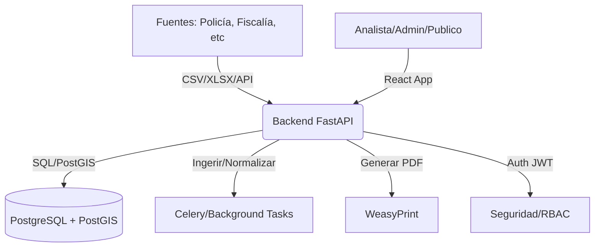

# Arquitectura Técnica - SISC Jamundí

## 1. Diagrama Conceptual

## 2. Stack Tecnológico
- **Base de Datos**: PostgreSQL 15 + PostGIS 3. Soporta tipos geométricos (Point, Polygon) y consultas espaciales.
- **Backend**: FastAPI (Python). Elegido por su velocidad, validación automática con Pydantic y generación de OpenAPI.
- **Frontend**: React 18 + Vite. Tailwind CSS para el diseño premium. Leaflet para la capa GIS.
- **Reportes**: Jinja2 para plantillas HTML y WeasyPrint para conversión a PDF.
- **Contenedores**: Docker Compose para orquestación de servicios (db, api, ui, worker).

## 3. Seguridad y Privacidad
- **Capa Analítica**: Se utilizarán capas de abstracción para que los analistas trabajen con datos seudonimizados. Los datos personales (nombres, cédulas) solo serán visibles para roles autorizados en la capa de "Staging".
- **Cifrado**: Contraseñas hasheadas con Argon2 o BCrypt. Tránsito cifrado (configuración TLS en entornos productivos).
- **Auditoría**: Todas las acciones de escritura y descarga de reportes quedan registradas en la tabla `audit_logs`.

## 4. Decisiones de Diseño
- **Normalización Territorial**: Se utiliza un catálogo maestro de barrios y veredas de Jamundí para evitar discrepancias en la cartografía.
- **Validación de Ingesta**: Los datos no entran a la tabla de producción si no pasan las validaciones de esquema y geocodificación.
- **Separación de Capas**: Staging (bruto), Integration (limpio), Analytics (agregado).
