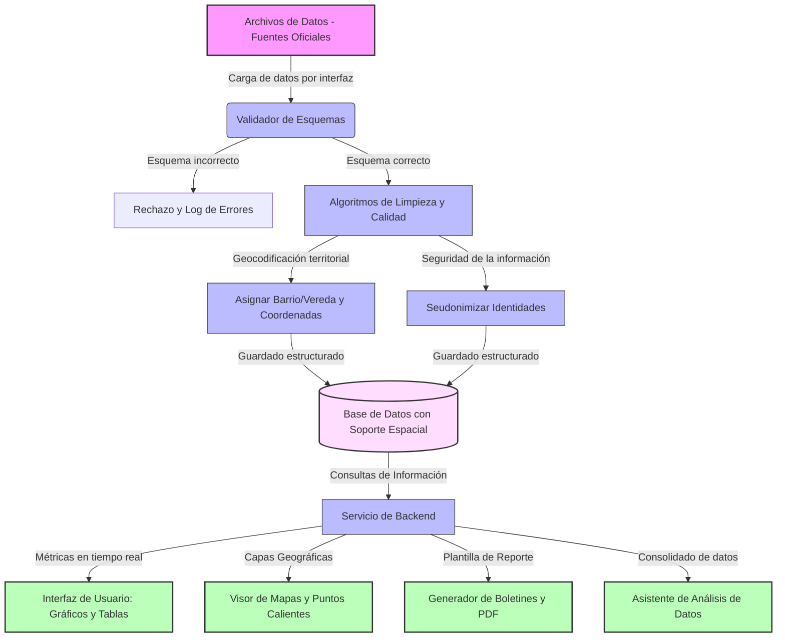

# Propuesta de Desarrollo desde Cero: Sistema de Información para la Seguridad y Convivencia (SISC Jamundí)

Este documento detalla el plan de diseño, desarrollo, flujos de datos, roles de usuario y plan de despliegue por fases para construir el **SISC Jamundí** desde cero, diseñado para servir como base de discusión en la mesa técnica con la Jefatura de TICS.

---

## 1. Alcance del Proyecto: ¿Qué es el SISC?

El SISC (Sistema de Información para la Seguridad y Convivencia) se concibe como una solución web para centralizar, limpiar, georreferenciar y analizar la información de delitos y contravenciones en el municipio de Jamundí. El objetivo principal es automatizar la consolidación de datos y la creación de boletines y mapas de calor, permitiendo a la Secretaría de Seguridad tomar decisiones estratégicas basadas en información depurada y oportuna.

---

## 2. Mapa de Actores y Roles (Quiénes intervienen)

El sistema se diseñará bajo un modelo de **Control de Acceso Basado en Roles (RBAC)**:

| Rol | Actor / Usuario | Permisos y Funciones Clave a Desarrollar |
| :--- | :--- | :--- |
| **Administrador del Sistema** | Administrador de Seguridad (Alcaldía) | Gestión de usuarios, asignación de roles, auditoría de accesos y configuración global del sistema. |
| **Cargador de Datos** | Enlaces de fuentes (Policía, Fiscalía, Comisarías) | Carga de archivos de datos e inspección preliminar de errores de calidad de datos. |
| **Analista del Observatorio** | Analistas de la Secretaría de Seguridad | Creación de indicadores, análisis espacial, generación y edición de boletines. Accede a **datos seudonimizados** para proteger la privacidad de la ciudadanía. |
| **Consulta Directiva** | Alcaldesa, Secretario de Seguridad, Directores | Visualización de tableros directivos, mapas agregados y descarga de informes aprobados. |
| **Público / Ciudadano** | Ciudadanía de Jamundí | Acceso a un portal de transparencia con estadísticas agregadas y reportes preventivos de seguridad ciudadana de forma anónima. |

---

## 3. Orígenes de Datos y Entregables (Inputs vs. Outputs)

El sistema procesará diversas fuentes de información para entregar herramientas analíticas al operador:

*   **Entradas (De dónde vienen los datos):**
    *   **Policía Nacional:** Datos de delincuencia y comparendos/medidas correctivas.
    *   **Fiscalía General:** Denuncias registradas de delitos de alto impacto.
    *   **Comisarías e Inspecciones:** Datos de violencia intrafamiliar y contravenciones locales.
    *   **Formatos iniciales:** Archivos planos de datos (planillas de cálculo), con proyección a integraciones automáticas vía servicios web.

*   **Salidas (Qué se le entrega al operador del sistema):**
    *   **Tablero de Control Dinámico:** Gráficos de tendencias, variaciones interanuales y tasas proyectadas por cada 100,000 habitantes.
    *   **Visor Geográfico:** Mapas dinámicos que identifican la concentración de incidentes sobre el mapa de barrios y veredas del municipio.
    *   **Generador de Boletines:** Exportación automatizada de reportes formales en formato no editable (PDF) listos para firma institucional.
    *   **Módulo de Asistencia Inteligente:** Apoyo en la redacción de resúmenes analíticos e interpretación de variaciones estadísticas.

---

## 4. Plan de Desarrollo por Fases (Hoja de Ruta desde Cero)

Para estructurar la construcción del sistema en la mesa de trabajo con TICS, proponemos el siguiente esquema en **5 Fases**:

```
 FASE 1: Base de Datos & Espacial --> FASE 2: API & Ingesta de Datos --> FASE 3: Interfaz & Mapas
             |                                     |                                   |
             v                                     v                                   v
       Modelo de Datos                       Lógica backend                     Visualización Web
             |                                     |                                   |
             +-------------------------------------+-----------------------------------+
                                                   |
                                                   v
                                     FASE 4: Reportes & Asistencia
                                                   |
                                                   v
                                     FASE 5: Seguridad & Infraestructura
```

### Fase 1: Arquitectura de Base de Datos y Modelo de Datos
*   **Base de Datos:** Diseño del motor de base de datos relacional con soporte para datos espaciales (coordenadas geográficas).
*   **Modelado:** Definición de esquemas para delitos, comparendos, división político-administrativa (catálogo de barrios y veredas) y bitácoras de auditoría.

### Fase 2: Lógica de Negocio y Calidad de Datos (Backend)
*   **Servicio de API:** Construcción del servidor de lógica de negocio para procesar las peticiones del usuario de forma rápida y segura.
*   **Control de Calidad de Datos (Data Quality):** Desarrollo de algoritmos de limpieza para detectar registros duplicados, corregir inconsistencias ortográficas de barrios y validar fechas.
*   **Privacidad:** Implementación de seudonimización y enmascaramiento de datos personales de las víctimas.

### Fase 3: Interfaz de Usuario y Visor Geográfico (Frontend)
*   **Interfaz Web:** Construcción de una aplicación de una sola página interactiva, fluida y con diseño adaptable a dispositivos móviles.
*   **Visualización Espacial:** Integración de un visor geográfico interactivo capaz de renderizar los polígonos de barrios y veredas, coloreándolos según la densidad delictiva.

### Fase 4: Reportabilidad y Asistencia de Análisis
*   **Generación de Documentos:** Desarrollo de un motor para exportar boletines ejecutivos basados en plantillas de diseño institucional.
*   **Procesamiento de Lenguaje:** Módulo para la interpretación de tendencias estadísticas que asista al analista en la redacción de informes ejecutivos.

### Fase 5: Seguridad, Auditoría y Despliegue
*   **Seguridad:** Implementación de protocolos de autenticación seguros y encriptación de datos en tránsito y en reposo.
*   **Auditoría:** Registro estricto de accesos, descargas de información y modificaciones en la base de datos.
*   **Virtualización:** Empaquetado del sistema en contenedores de virtualización aislados para garantizar la portabilidad entre diferentes entornos.

---

## 5. Diagrama de Flujo Procedimental de Datos

El siguiente flujo muestra de manera conceptual cómo se procesarán los datos en el sistema propuesto:



---

## 6. Alternativas de Servidor e Infraestructura

Para coordinar con TICS dónde alojar la aplicación web una vez desarrollada desde cero:

### Opción A (Local con Túnel de Red Seguro)
*   **Descripción:** Configurar un equipo dedicado en la infraestructura local de la Secretaría como servidor físico de la aplicación.
*   **Conectividad:** Se instala un túnel de red seguro cifrado de salida que expone la aplicación de forma externa sin necesidad de abrir puertos en el firewall institucional de la Alcaldía.
*   **Ventajas:** Costo cero de servidores externos, soberanía absoluta sobre los datos y aislamiento de la red local.

### Opción B (Servidor Institucional - On-Premise o Nube)
*   **Descripción:** Alojamiento en una máquina virtual Linux o servidor físico del centro de datos administrado por TICS o contratado en la nube de la alcaldía.
*   **Ventajas:** Alta disponibilidad, respaldos programados en el centro de datos y mantenimiento preventivo por parte del personal de infraestructura de TICS.

---

## 7. Propuesta de Coordinación para la Mesa Técnica

Para iniciar el desarrollo, se propone la siguiente agenda de trabajo con la Jefatura de TICS:
1.  **Validación del Flujo del Dato:** Confirmar si el procesamiento conceptual de datos cumple con los estándares institucionales.
2.  **Definición de Infraestructura:** Evaluar la viabilidad de la **Opción A (Servidor Local con Túnel)** o la viabilidad técnica de que TICS provea un **Servidor de Pruebas**.
3.  **Habilitación del Subdominio:** Coordinar con el área de redes la vinculación de un subdominio gubernamental oficial para el direccionamiento seguro del sistema.
4.  **Desarrollo asistido por IA:** Establecer los repositorios de código oficiales para el desarrollo colaborativo y control de versiones.
