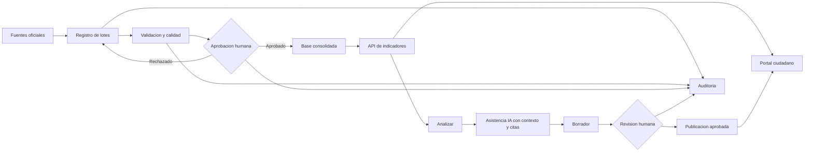

# Simplificacion estrategica del SISC

**Fecha de auditoria:** 12 de agosto de 2026

**Estado:** hoja de ruta aprobada; Fase 0 en ejecucion

**Decision central:** el SISC sera el sistema institucional de registro, calidad, gobierno y publicacion. La IA sera una herramienta asistiva sobre datos aprobados, no la fuente oficial ni quien aprueba decisiones.

## Estado de ejecucion

**Completado el 12 de agosto de 2026:**

- la generacion publica de SISC en cifras produce solo una vista previa; guardar un borrador exige sesion y rol autorizado;
- el historial de publicaciones, analitica interna, expedientes, calidad y aprobaciones institucionales quedaron protegidos por nivel o rol;
- el disparador automatico de reportes falla cerrado y acepta solamente una sesion autorizada o una llave de servicio;
- CORS usa origenes explicitos, las claves inseguras dejaron de tener valores predeterminados conocidos y los errores publicos ya no exponen excepciones internas;
- los formularios ciudadanos y el chat tienen limites de entrada, y los contratos criticos cuentan con pruebas de autorizacion;
- la eliminacion completa de la bodega quedo limitada a `TI_ADMIN`, exige una frase de confirmacion y genera auditoria de nivel restringido.

**Pendiente para cerrar la Fase 0:** telemetria de uso sin datos personales, propietario formal por fuente/publicacion y decision sobre cookies seguras para la sesion web.

## 1. Hallazgos del inventario

- El frontend contiene 38 paginas y el menu institucional muestra hasta 18 entradas segun el rol.
- El backend registra 14 routers y alrededor de 75 endpoints. `intelligence.py` concentra mas de 2.000 lineas y responsabilidades de ingesta, estadistica, alertas, reportes y RNMC.
- Existen capacidades repetidas entre `Dashboard`, `StatsModule`, `IntelligenceModule`, `MapPage`, `ReportsPage` y `DataPage`.
- `CitizenPortalHub.jsx` y `PublicDashboard.jsx` quedaron reemplazados por las nuevas experiencias, pero aun existen como codigo legado sin rutas activas.
- Hay paginas implementadas sin ruta activa en `App.jsx`, por ejemplo `PanicButtonPage` y `PanicMonitoring`.
- Hay rutas registradas en `App.jsx` que no aparecen en el menu, como `regional_context`, `rnmc`, `access_requests` y `police_audit`.
- La arquitectura documental describe capas limpias y gobierno del dato, pero la interfaz actual organiza el trabajo por herramientas tecnicas y fuentes, no por el flujo operativo de una persona.
- Solo hay siete archivos de pruebas automatizadas. La cobertura es buena en comparaciones publicas, relevancia de SISC en cifras, historia de sabanas, alertas e inspecciones, pero insuficiente para permisos, aprobaciones y publicaciones.

## 2. Principio de producto

El producto objetivo debe resolver un flujo unico:

```text
Fuente oficial -> Cargar -> Validar -> Aprobar -> Consolidar
               -> Explorar -> Redactar con asistencia -> Revisar -> Publicar
```

La IA puede:

- proponer consultas y filtros;
- explicar variaciones calculadas por el sistema;
- redactar borradores con citas de fuente, periodo y corte;
- resumir incidencias de calidad;
- ayudar a construir una pieza o informe.

La IA no puede:

- modificar cifras oficiales;
- aprobar lotes, alertas o publicaciones;
- inventar causalidad o completar datos ausentes;
- acceder a campos personales por defecto;
- publicar sin revision humana y trazabilidad.

## 3. Matriz de decision del frontend institucional

| Modulo actual | Decision | Destino propuesto | Motivo |
|---|---|---|---|
| Dashboard | Fusionar | **Inicio / Bandeja de trabajo** | Debe mostrar pendientes, cortes y accesos por rol; no repetir todas las graficas. |
| Monitor Mindefensa | Fusionar | **Fuentes** | Es vigilancia del estado de una fuente. |
| Monitor Policia | Fusionar | **Fuentes** | Misma funcion operativa con otro conector. |
| Ingesta Universal | Conservar y simplificar | **Fuentes > Cargar** | Es parte esencial del registro institucional. |
| Explorador Policial | Fusionar | **Fuentes > Historial** y **Analizar** | Separa auditoria de carga y exploracion estadistica. |
| Calidad (DQ) | Conservar | **Calidad y aprobacion** | Es una ventaja institucional que ChatGPT no reemplaza. |
| Auditoria de ingesta policial | Fusionar | **Calidad > Detalle del lote** | No necesita entrada principal propia. |
| Agentes institucionales | Conservar, renombrar | **Fuentes > Otras dependencias** | Mantiene lotes, hallazgos y aprobacion; evitar presentar automatizacion como autoridad. |
| Inspecciones MIP | Conservar como dominio | **Fuentes > Inspecciones** | Contiene expedientes y actuaciones con acceso restringido. |
| Estadisticas | Fusionar | **Analizar** | Se superpone con Dashboard e Inteligencia. |
| Mapa interactivo | Fusionar | **Analizar > Territorio** | El mapa es una vista del analisis, no un producto aislado. |
| Analisis IA | Reemplazar como pantalla | **Asistente contextual en Analizar** | La IA debe trabajar junto a filtros, cifras y fuentes verificables. |
| Alertas tempranas | Conservar y restringir | **Seguimiento** | Requiere estados, responsables, evidencia y auditoria; la IA solo prioriza como sugerencia. |
| RNMC | Fusionar | **Seguimiento > Convivencia** | Comparte flujo con alertas y medidas. |
| Contexto regional | Fusionar o pausar | **Analizar > Contexto** | Tiene valor comparativo, pero no amerita entrada principal. |
| Reportes | Fusionar | **Publicar** | Unificar PDF, boletines, historial y aprobacion. |
| SISC en cifras | Conservar | **Publicar > Redes** | Salida ciudadana repetible y basada en datos reales. |
| Descarga CSV/XLS | Fusionar | **Analizar > Exportar** | Exportar es una accion contextual, no un modulo. |
| Usuarios | Conservar y restringir | **Administracion** | Gobierno de acceso. |
| Solicitudes de acceso | Fusionar | **Administracion > Accesos** | Parte de usuarios y roles. |
| Auditoria | Conservar y restringir | **Administracion > Auditoria** | Control institucional obligatorio. |
| PanicButtonPage / PanicMonitoring | Pausar y aislar | Producto separado sujeto a evaluacion | Es un flujo de emergencia de alto riesgo sin rutas activas ni pruebas suficientes. |

## 4. Matriz del portal ciudadano

| Experiencia actual | Decision | Observacion |
|---|---|---|
| Inicio ciudadano | Conservar | Es la entrada oficial y muestra corte, fuente y privacidad. |
| Explorar datos y mapa | Conservar | Mantener filtros compartibles y agregacion territorial. |
| Mi barrio | Conservar dentro de Inicio/Explorar | No crear otra aplicacion paralela. |
| SISC en cifras | Conservar con revision | Generacion publica puede previsualizar; guardar/publicar debe autenticarse. |
| Boletines | Conservar y completar | Falta catalogo real de publicaciones aprobadas. |
| Datos abiertos | Conservar | Solo datos agregados y diccionario. |
| Metodologia | Conservar | Diferencia fuentes y limites de interpretacion. |
| Inspecciones, comisarias y medidas | Conservar como servicios ciudadanos | No mezclar sus registros administrativos con delitos. |
| Reporte seguro y participacion | Conservar con gobierno | Son transacciones institucionales, no analitica. |
| Chat ciudadano | Limitar | Orientacion y explicacion de datos publicos; nunca respuestas operativas sensibles. |
| CitizenPortalHub / PublicDashboard antiguos | Retirar despues de verificacion | Ya no tienen ruta activa. |

## 5. Navegacion institucional objetivo

Reducir el menu principal de hasta 18 entradas a seis areas:

1. **Inicio**
   - estado de fuentes;
   - lotes pendientes de validar o aprobar;
   - alertas pendientes;
   - publicaciones en borrador;
   - accesos segun rol.
2. **Fuentes**
   - Policia;
   - Mindefensa;
   - Inspecciones;
   - Comisarias y otras dependencias;
   - carga e historial.
3. **Calidad**
   - validaciones;
   - duplicados y hallazgos;
   - aprobacion o rechazo;
   - trazabilidad del lote.
4. **Analizar**
   - indicadores y comparaciones;
   - territorio y mapa;
   - convivencia y RNMC;
   - contexto regional;
   - asistente IA contextual;
   - exportacion.
5. **Seguimiento**
   - alertas;
   - medidas y compromisos;
   - responsables, estado y evidencia.
6. **Publicar**
   - SISC en cifras;
   - boletines PDF;
   - biblioteca e historial;
   - datos abiertos;
   - revision y aprobacion.

**Administracion** debe quedar separada al final y visible solo para roles autorizados: usuarios, solicitudes, auditoria y configuracion.

## 6. Arquitectura funcional objetivo



## 7. Riesgos que deben resolverse antes de ampliar IA

### Prioridad critica

1. `POST /api/sisc-cifras/generate` permite `save_history=true` sin autenticacion y acepta `x-sisc-user` como identidad declarada por el cliente. Separar previsualizacion publica de guardar/publicar autenticado.
2. Algunos endpoints de `intelligence.py` modifican o exponen operaciones sin una dependencia de autenticacion consistente. Hacer una matriz endpoint-rol y negar por defecto.
3. El manejador global devuelve `str(exc)` al cliente y escribe errores durante la peticion. En produccion debe entregar un identificador de incidente, no detalles internos.
4. CORS permite cualquier origen. Configurar una lista explicita por ambiente.

### Prioridad alta

5. Los tokens JWT viven en `localStorage`; una futura iteracion debe evaluar cookies `HttpOnly`, `Secure` y proteccion CSRF acorde con la arquitectura de despliegue.
6. Existen tokens en query parameters para algunas descargas. Preferir enlaces firmados de vida corta y uso unico, sin JWT reutilizable en URL.
7. `ingesta/clear` elimina datos y esta expuesto desde una pagina generica. Requiere confirmacion fuerte, rol especifico, auditoria y estrategia de recuperacion.
8. `intelligence.py` tiene rutas duplicadas (`/executive-brief`) y demasiadas responsabilidades. Dividirlo por dominio antes de agregar mas funciones.

## 8. Plan de migracion sin ruptura

### Fase 0 - Seguridad y medicion

- proteger mutaciones y publicaciones;
- crear matriz endpoint-rol y pruebas de autorizacion;
- registrar telemetria basica de uso por modulo sin datos personales;
- definir propietario institucional para cada fuente y publicacion.

### Fase 1 - Simplificar solo la navegacion

- introducir las seis areas objetivo;
- mantener las paginas actuales detras de esas areas;
- conservar rutas antiguas temporalmente como compatibilidad;
- medir uso y errores antes de retirar codigo.

### Fase 2 - Fusionar flujos

- unir monitores e ingesta bajo Fuentes;
- unir calidad, agentes y auditoria de lote;
- crear Analizar como contenedor de indicadores, mapa y contexto;
- mover exportaciones a la vista analitica;
- unificar reportes y SISC en cifras bajo Publicar.

### Fase 3 - IA asistiva

- proporcionar al asistente solamente vistas autorizadas y metadatos de fuente;
- exigir que cada afirmacion incluya indicador, periodo, comparacion y corte;
- guardar prompt, version del modelo, fuentes consultadas y respuesta en auditoria;
- marcar siempre el resultado como borrador hasta revision humana.

### Fase 4 - Retiro controlado

- eliminar paginas antiguas solo cuando no tengan rutas, uso ni dependencias;
- retirar codigo duplicado con pruebas de regresion;
- actualizar PRD, arquitectura, diccionario y manual operativo.

## 9. Criterios de exito

- Un usuario institucional encuentra cualquier tarea frecuente en dos niveles o menos.
- Ninguna cifra puede publicarse sin fuente, periodo, corte y responsable.
- Toda escritura sensible queda autenticada y auditada.
- Una sola vista calcula cada indicador; las demas consumen ese contrato.
- La IA reduce tiempo de analisis y redaccion, pero nunca reemplaza aprobacion ni trazabilidad.
- El portal ciudadano permanece disponible aunque el proveedor de IA no responda.

## 10. Decision inmediata recomendada

No construir mas modulos independientes. La siguiente implementacion debe ser **Fase 0** y luego una **navegacion institucional agrupada**, manteniendo las pantallas existentes internamente. Esto produce simplificacion visible con bajo riesgo y prepara una integracion de IA realmente util.
